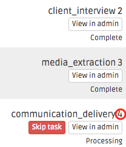

###############
Orchestra Bots
###############

Below, we'll walk through the various bots available in Orchestra.

*********
StaffBot
*********

Setup
-----

``StaffBot`` provides a simple way to ask a group of ``Workers`` if they would
like to work on a particular ``Task``. The goal is reduce the human load when
finding a ``Worker`` for  a ``Task``. ``StaffBot`` allows a user to interact
with Orchestra via `Slack`_ or can be configured to automatically find
``Workers`` for a ``Task`` when it is available by setting up an `Assignment
Policy`_.

``StaffBot`` works by reaching out to qualified ``Workers`` and offering them a
``Task`` to work on. ``Workers`` can then either accept or reject the task (via
Slack or email) and start working on it.

Slack
=====

To interact with ``StaffBot`` via Slack, you first need to configure a `Slack
Slash Command <https://api.slack.com/slash-commands>`_. Below is a sample
configuration for the ``/staffbot`` command.

.. image:: ../static/img/bots/slash_command_config_token.png

Once the command is created, copy the token for the command into your project
settings as follows: ``ORCHESTRA_SLACK_STAFFBOT_TOKEN = 'your-token-here'``.
The token is used to authenticated requests sent to the staffbot url. It is
important to keep this token secret since otherwise anyone may make a ``HTTP
POST`` and execute the staffing logic!

In addition to the ``ORCHESTRA_SLACK_STAFFBOT_TOKEN`` setting, you can further
restrict access to the endpoint by specifying the following::

 STAFFBOT_CONFIG = {
            'allowed_team_ids': ['allowed_team_ids'],
            'allowed_team_domains': ['allowed_domains'],
            'allowed_channel_ids': ['allowed_channel_ids'],
            'allowed_channel_names': ['allowed_channel_names'],
            'allowed_user_ids': ['allowed_user_ids'],
            'allowed_user_names': ['allowed_user_names'],
            'allowed_commands': ['allowed_commands'],
        }

``StaffBot`` will use the ``STAFFBOT_CONFIG`` to filter messages that do not
match items in the list. If a parameter is not specified, all values are
accepted by default.

Once this configuration is complete, you can test it by typing
``/staffbot staff <task-id>`` where ``<task-id>`` is an unassigned
task id.  By default, ``StaffBot`` will reach out to ``Workers`` who
have the appropriate ``WorkerCertification`` for the task you are
staffing, in batches of
``settings.ORCHESTRA_STAFFBOT_WORKER_BATCH_SIZE Workers`` every
``settings.ORCHESTRA_STAFFBOT_BATCH_FREQUENCY`` time units (the
frequency is a ``datetime.timedelta`` object).

``StaffBot`` looks at two fields when prioritizing ``Workers`` to
reach out to when a task is available.  The
``WorkerCertification.staffbot_enabled`` field (``True`` by default)
tells ``StaffBot`` whether to reach out to a ``Worker`` because they
have a given certification.  If you set it to ``False``, the
``Worker`` will still be able to pick up tasks requiring certification
(e.g., you can still manually assign tasks to that ``Worker``), but
``StaffBot`` will not reach out to them for those tasks.  The
``Worker.staffing_priority`` integer field (``0`` by default) helps
``StaffBot`` prioritize amongst certified ``Workers``.  If ``Workers``
have the same ``staffing_priority``, ``StaffBot`` will prioritize them
randomly.

Assignment Policy
================

``StaffBot`` can also automatically staff projects by specifying an Assignment
Policy. Orchestra supports custom logic for assigning ``Workers`` to tasks, and
``StaffBot`` leverages this by asking qualified ``Workers`` if they would like
to work on a ``Task`` as soon as the ``Task`` is available. To specify the
``StaffBot`` auto-assignment policy, which uses the same logic as the
``/staffbot staff`` command, add the following to the ``Step`` configuration in
your ``version.json`` file. Following the Journalism Workflow Example we have::

  [...step definition...]
  "assignment_policy": {
      "policy_function": {
          "entry_level": {
              "path": "orchestra.bots.assignment_policies.staffbot_autoassign"
          }
      }
  },
  [...step definition...]

Now, for entry-level tasks within the defined step, ``StaffBot`` will
automatically try to staff this ``Task``. If the task requires review, manual
assignment is necessary unless we add a ``reviewer`` key to the policy
function::

  [...step definition...]
  "assignment_policy": {
      "policy_function": {
          "entry_level": {
              "path": "orchestra.bots.assignment_policies.staffbot_autoassign"
          },
          "reviewer": {
              "path": "orchestra.bots.assignment_policies.staffbot_autoassign"
          }
      }
  },
  [...step definition...]

Detailed Description Function
=============================

The ``detailed_description_function`` is used to dynamically describe a
``Task`` when ``StaffBot`` makes requests to ``Workers``, offering them the
opportunity to work on the ``Task``. The function is given a ``task_details``
dictionary and can be passed extra ``kwargs`` as shown below::

  [...step definition...]
  "detailed_description_function": {
       "path": "my_project.orchestra_helpers.get_detailed_description",
       "kwargs": {
           "text": "Task text"
       }
  }
  [...step definition...]

::

  # my_project/orchestra_helpers.py

  def get_detailed_description(task_details **kwargs):
    return '''A new task is available!
              Find out more about {} at example.com/projects/{}!'''.format(
              kwargs.get('text'), task_details['project']['id'])
Usage
-----

Automatic Task Staffing in Orchestra
====================================

``StaffBot`` allows interaction with Orchestra via Slack to assign or reassign
an expert to a task. To use ``StaffBot``, simply type ``/staffbot`` into your
slack window, and will see an autocomplete similar to:

.. image:: ../static/img/bots/slash_command_window.png

You can send two different commands to ``StaffBot``: 1) ``staff``, and  2)
``restaff``.

Using the ``staff`` command
==========================

To use the ``staff`` command, you need to specify a ``<task-id>`` of a task
that is unassigned. You can find the ``<task-id>`` in the project view (shown
below) or from notification emails/Slack messages about a project.

In this example, you have just finished the ``client_interview`` task and need
to add someone to the ``communication_delivery`` task with id ``4`` (shown in
red), so you can type::

  /staffbot staff 4

``Staffbot`` will then reach out to eligible experts asking them if they would
like to work on the task. Once one of them accepts, they will be added to the
private Slack channel for the project and can begin working on the task.

If a task has a review step, you can use ``StaffBot`` to assign an expert to
the review step once the first expert has submitted their work for review.

Using the ``restaff`` command
=============================

You can also use the ``restaff`` command to offer a task to a different expert.
This will be useful if a expert is unable to complete the task. Following the
example above, assume that the worker ``joshblum`` accepted the task ``4``.
To restaff this task you can type::

  /staffbot restaff 4 joshblum

This will offer the task again to eligible experts, and once a new expert
accepts, ``joshblum`` will be removed and the new expert will be added.
