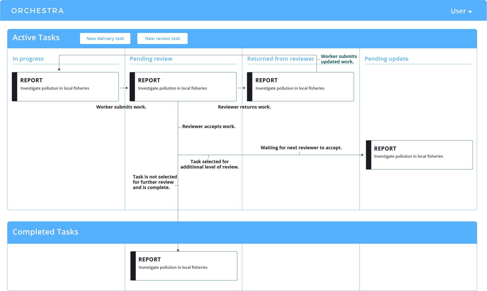
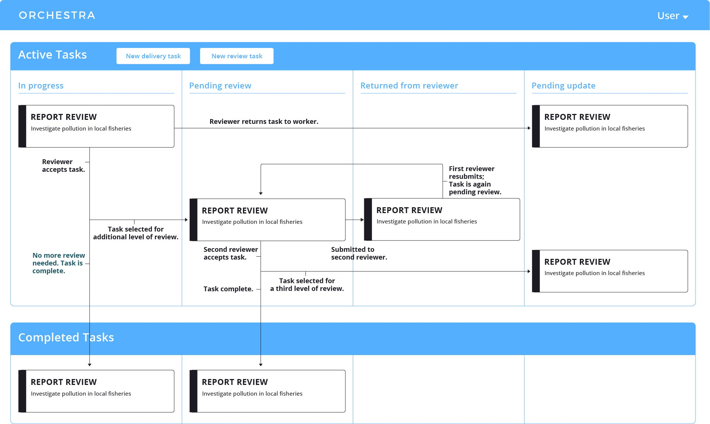

Key Concepts
============

Let's first recap our example reporting workflow:

.. image:: ../static/img/journalism_workflow/workflow.png
   :height: 300px

- An editor finds a good story and sends a reporter off to investigate.
- The reporter writes up a draft article.
- A more experienced reporter then reviews the article and suggests improvements.
- In parallel with the reporting step, a photographer captures photos for the story.
- A senior photographer reviews the photos and selects the best ones.
- The selected photos are resized and recolored for display across different media.
- Finally, a copy editor adds headlines and photo captions to complete the story.

We'll now walk you through major Orchestra concepts based on the example above.

Workflows
---------
- The entire process above is called a **workflow**, comprised of five component **steps**.
- Two of these steps require **review**, where more experienced experts review the original work performed. Custom review policies (e.g., sampled or systematic review) for tasks can be easily created in Orchestra.
- The photo resizing step is a **machine step**, completed by automation rather than by experts.
- Each step emits a JSON blob with structured data generated by either humans or machines.
- Steps have access to data emitted by previous steps that they depend on. In the example, the copy editor has access to both the story and the resized photos.

Project Distribution
--------------------
- **Projects** are a series of interconnected **tasks**. A project is an instance of a workflow; a task is an instance of a step.

  - *An editor with a story about local elections would create an elections project, with tasks for a reporter/photographer/copy editor.*
- **Tasks** are carried out by an **expert** or by a **machine**.

  - *Photographers capture the story.*
  - *Machines resize and recolor the photos.*

- Experts can come from anywhere, from a company's employees to freelancers on platforms like Upwork.

Hierarchical Review
-------------------
- **Core experts** do the initial work on a task.
- **Reviewers** provide feedback to other experts to make their work even better.
- The core expert **submits** the task when their work is complete.
- The reviewer can choose to **accept** the task, which is either selected for further review or marked as complete.
- They could also choose to **return** the task, requesting changes from and giving feedback to the worker they are reviewing.

Worker Certification
--------------------
- Certifications allow experts to work on tasks they're great at.
- Experts can work toward all sorts of certifications, picking up practice tasks to build experience.

  - *Joseph is a solid reporter but needs a little more practice as a photographer—let's give him some simple tasks so he can improve!*

- Experts need additional certification to work in a reviewer role.

  - *Amy has been reporting for quite some time and would be great at mentoring new reporters.*

Life of a Task
--------------
Below are two images of the Orchestra dashboard, the launching point for expert workers.
Click to see how tasks move differently across the dashboard for core workers and reviewers.

Core Expert
~~~~~~~~~~~
A core expert performs initial task work which will later be reviewed. The diagram below shows a task's movement through the core worker's dashboard.

Reviewer
~~~~~~~~
A reviewer evaluates the core expert's work and provides feedback. The diagram below shows a task's movement through a reviewer's dashboard.

