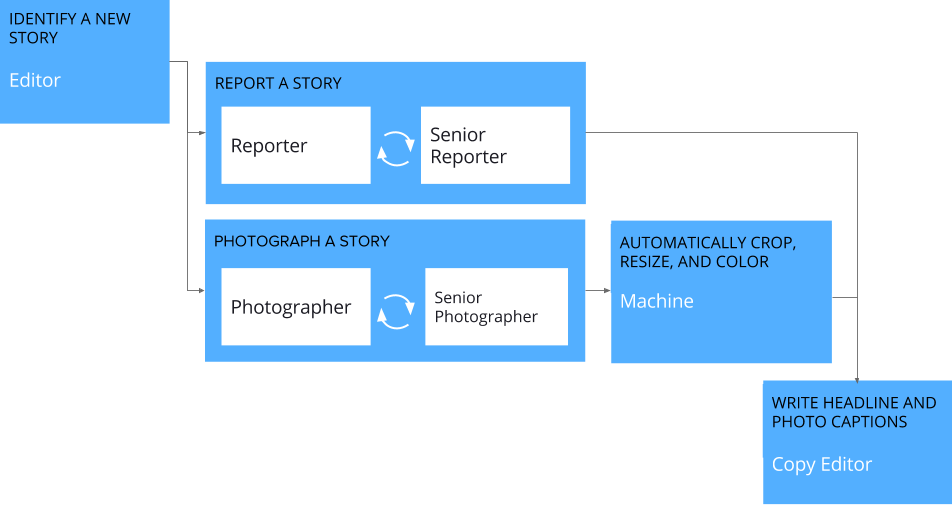
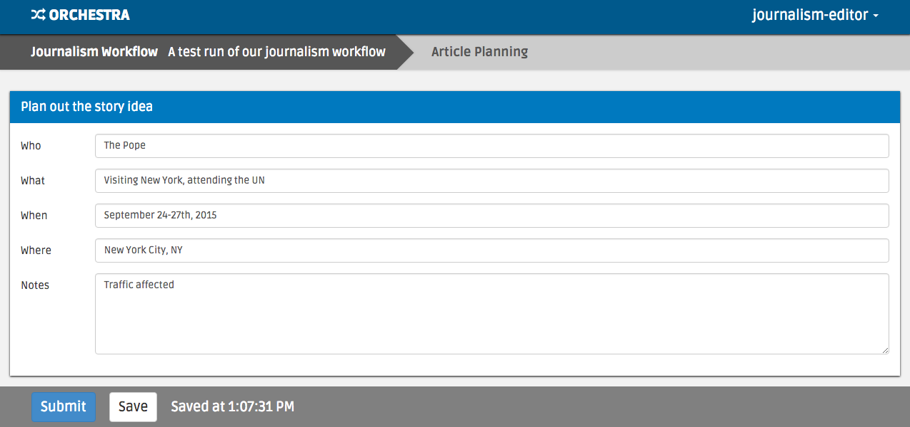
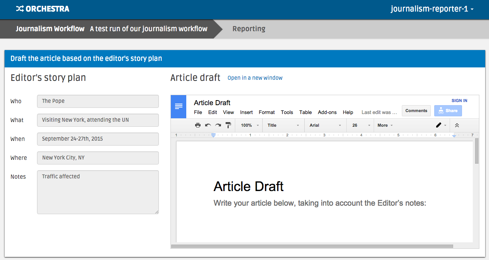
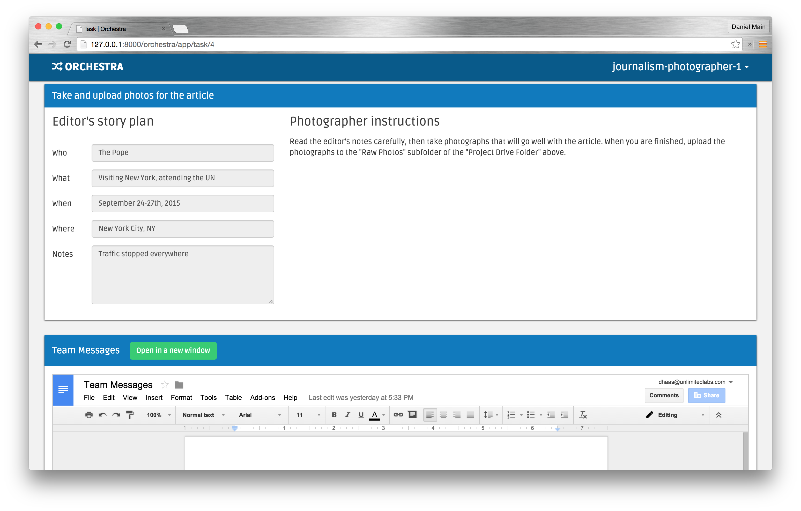
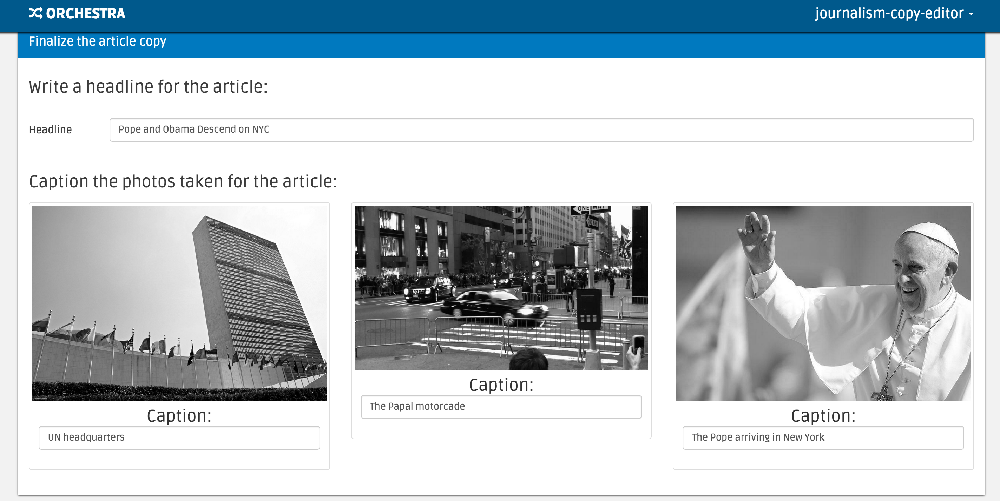

##############################
Example Use Case: The Newsroom
##############################

Below we'll walk you through an example of how Orchestra could be used in a
newsroom by journalists, editors, and photographers to craft a story. The code
for this example can be found `in our github repo
<https://github.com/unlimitedlabs/orchestra/tree/stable/journalism_workflow>`_.

************
The workflow
************

The image above depicts our example workflow, which is composed of the
following steps:

* An editor finds a good story and sends a reporter off to investigate.

* The reporter writes up a draft article.

* A more experienced reporter then reviews the article and suggests
  improvements.

* In parallel with the reporting step, a photographer captures photos for the
  story.

* A senior photographer reviews the photos and selects the best ones.

* The selected photos are resized and recolored for display across different
  media.

* Finally, a copy editor adds headlines and photo captions to complete the
  story.

To make things work in practice, there's also a hidden machine step at the
beginning of the workflow to set up some google documents and folders for
article writing and image storage.

********************
Running the workflow
********************

Setup
=====

If you haven't followed the :doc:`getting started guide <getting_started>` to
set up Orchestra yet, you should do that now. Also, make sure that
``'journalism_workflow'`` is in your ``INSTALLED_APPS`` setting, and that you
have loaded the workflow into the database (``python manage.py loadworkflow
journalism_workflow v1``).

The journalism workflow requires Google Apps integration to run,
so make sure in ``orchestra_settings.py`` you set ``settings.GOOGLE_APPS`` to
``True``, and fill in values for ``settings.GOOGLE_SERVICE_EMAIL``,
``settings.GOOGLE_P12_PATH``, and ``settings.GOOGLE_PROJECT_ROOT_ID``. Set up
and correct values for those settings are described in `the Google Apps
documentation <https://developers.google.com/drive/web/delegation>`_.

Next, make sure you have the journalism workflow sample data installed by
running (if you haven't already) ``python manage.py loadworkflowsampledata
journalism/v1``. This will create the following accounts:

* username: ``journalism-editor``, password: ``editor``. A worker with
  ``editor`` certification.

* username: ``journalism-reporter-1``, password: ``reporter``. A worker
  with entry-level ``reporter`` certification.

* username: ``journalism-reporter-2``, password: ``reporter``. A worker
  with review-level ``reporter`` certification.

* username: ``journalism-photographer-1``, password: ``photographer``. A
  worker with entry-level ``photographer`` certification.

* username: ``journalism-photographer-2``, password: ``photographer``. A
  worker with review-level ``photographer`` certification.

* username: ``journalism-copy-editor``, password: ``copy-editor``. A worker
  with ``copy_editor`` certification.

Start the workflow
=====================

The journalism workflow comes with a management script to start and monitor the
workflow. To start the workflow:

* Make sure Orchestra is running with ``python manage.py runserver``.

* In another tab, run::

      python manage.py journalism_workflow_ctl --new

This will take a bit (because it is automatically running the document
creation workflow step), but will eventually return a project id (probably
``1``), which you should store for future use, and output JSON info about
the project.

Complete the steps
==================

To navigate the workflow, first log in as the ``journalism-editor`` user and
request a new task. The interface should look like the image below:

Fill out the high-level story idea and submit the task.

Next, log in as the ``journalism-reporter-1`` worker, and you should now have
a reporting task available. The interface looks like the image below--use the
google doc to write your article.

When you submit, you'll note that the task appears in the 'Awaiting Review'
section. That's your cue to log in as ``journalism-reporter-2`` and review the
work. Once you're satisfied with it, accept it.

In parallel to logging in as a reporter, you can log in as
``journalism-photographer-1`` and ``journalism-photographer-2`` to take and
review photographs relevant to the article. You should see an interface like the
image below, which encourages you to add photos to a shared 'Raw Photos' folder.
The interface should look like the below:

Once you've accepted the photography as ``journalism-photographer-2``, the
machine task to auto-process the photos should run. Our implementation simply
makes any images in 'Raw Photos' greyscale, but you could imagine more
complicated adjustments.

Finally, log in as ``journalism-copy-editor`` to give the article a headline
and caption the photos. You should observe that your photos have been greyscaled
as desired, as in the image below:

Once you submit the task, the workflow is done! You've successfully
coordinated 6 expert workers and 2 machine tasks to tell a story.

Verify the final JSON output
============================

You'll note that our workflow didn't actually lay the article out in its final
print or electronic form. That's because, in reality, this workflow would have
been kicked off by a newsroom's content management system with auto-layout
capabilities based on the JSON the project produced. To see the JSON that the
workflow produces for input into such a system, run::

  python manage.py journalism_workflow_ctl --finish -p <PROJECT_ID>

where ``<PROJECT_ID>`` is the project id you were given when you created the
project.

You should see output like::

  {'articleDocument': 'https://docs.google.com/document/d/someid',
   'headline': 'Your Headline',
   'photos': [{'caption': 'Your Caption 1',
               'src': 'https://docs.google.com/uc?id=someid'},
              {'caption': 'Your Caption 2',
	       'src': 'htps://docs.google.com/uc?id=someid2'},
	       ...
	      ]
   }

which summarizes all of the work accomplished in the workflow.

********
The code
********

All of the code used to create the new room workflow is located `in our
github repo
<https://github.com/unlimitedlabs/orchestra/tree/stable/journalism_workflow>`_.
There are three main components to the code: The workflow definition, the
interface implementations for the human steps, and the python code for the
machine steps.

.. _workflow_def:

The workflow definition
=======================

The workflow is defined in `journalism_workflow/workflow.json <https://github.com/unlimitedlabs/orchestra/blob/stable/journalism_workflow/workflow.json>`_,
and its latest version (version 1) is defined in `journalism_workflow/v1/version.json <https://github.com/unlimitedlabs/orchestra/blob/stable/journalism_workflow/v1/version.json>`_.
These files declaratively defines the steps listed above, in programmatic form.

`workflow.json <https://github.com/unlimitedlabs/orchestra/blob/stable/journalism_workflow/workflow.json>`_
defines the workflow with a name and short description::

  {
    "slug": "journalism",
    "name": "Journalism Workflow",
    "description": "Create polished newspaper articles from scratch.",
  }

It also describes certifications required by the workflow::

  {
    "certifications": [
      {
        "slug": "editor",
        "name": "Editor",
        "description": "Trained in planning story ideas"
      },
      {
        "slug": "reporter",
        "name": "Reporter",
        "description": "Trained in researching and writing articles"
      },
      {
        "slug": "photographer",
        "name": "Photographer",
        "description": "Trained in taking photos for articles"
      },
      {
        "slug": "copy_editor",
        "name": "Copy Editor",
        "description": "Trained in assembling photos and text into article layout"
      }
    ]
  }

And provides the location of a python function to load sample data::

  {
    "sample_data_load_function": {
      "module": "journalism_workflow.load_sample_data",
      "name": "load"
    }
  }

``version.json`` defines the steps of the workflow. Check out `the source <https://github.com/unlimitedlabs/orchestra/blob/stable/journalism_workflow/v1/version.json>`_
for all of the step definitions, but here we'll list two.

Below is the definition of the human step that takes an editor's story idea and
asks a reporter to write an article based on it::

  {
    "slug": "reporting",
    "name": "Reporting",
    "description": "Research and draft the article text",
    "is_human": true,
    "creation_depends_on": [
      "article_planning"
    ],
    "required_certifications": [
      "reporter"
    ],
    "review_policy": {
      "policy": "sampled_review",
      "rate": 1,
      "max_reviews": 1
    },
    "user_interface": {
      "angular_module": "journalism_workflow.v1.reporter.module",
      "angular_directive": "reporter",
      "javascript_includes": [
        "/static/journalism_workflow/v1/reporter/js/modules.js",
	"/static/journalism_workflow/v1/reporter/js/controllers.js",
	"/static/journalism_workflow/v1/reporter/js/directives.js"
      ]
    }
  }

Note that we've specified step dependencies with ``creation_depends_on``,
required worker skills with ``required_certifications``, and user interface
javascript files with ``user_interface``. In addition, we've asked that all
reporters have their work reviewed by a senior reporter by specifying a
sampled ``review_policy`` with a rate of 100% (``rate`` goes from 0 to 1).

Next, we show a machine step, in this case the step that takes our
photographers' output (a directory of images), and processes those images for
layout::

  {
    "slug": "photo_adjustment",
    "name": "Photo Adjustment",
    "description": "Automatically crop and rescale images",
    "is_human": false,
    "creation_depends_on": [
      "photography"
    ],
    "execution_function": {
      "module": "journalism_workflow.v1.adjust_photos",
      "name": "autoadjust_photos"
    }
  }

The basic arguments are similar, but we specify the step type as not human
(``"is_human": false``), and insead of a user interface, we pass a python
function to execute (``autoadjust_photos`` here).

The interface implementations
=============================

In order for our workflows to be usable by experts, we need to display an
interface for each human step. Orchestra uses `angular.js
<https://angularjs.org/>`_ for all of our interfaces. The interfaces all live
under `journalism_workflow/static/journalism_workflow <https://github.com/unlimitedlabs/orchestra/tree/stable/journalism_workflow/static/journalism_workflow>`_.

Remember that in our :ref:`workflow definition <workflow_def>`, we specified
user interfaces with JSON that looked like this::

  {
    "angular_module": "journalism_workflow.v1.editor.module",
    "angular_directive": "editor",
    "javascript_includes": [
      "/static/journalism_workflow/v1/editor/js/modules.js",
      "/static/journalism_workflow/v1/editor/js/controllers.js",
      "/static/journalism_workflow/v1/editor/js/directives.js"
    ],
    "stylesheet_includes": []
  }

Orchestra will automatically inject the specified ``angular_directive`` into
the website, which should be implemented in the files listed in
``javascript_includes``. To have CSS available in your interface, just list
the file paths in ``stylesheet_includes``.

An angular interface is composed of a few things: a `controller
<https://docs.angularjs.org/guide/controller>`_ that sets up state
for the interface, a `directive <https://docs.angularjs.org/guide/directive>`_
that injects the interface into a website, a `module
<https://docs.angularjs.org/guide/module>`_ that registers the controllers and
directives, and a `partial <https://docs.angularjs.org/guide/templates>`_ that
contains an html template for the interface. The `angular docs
<https://docs.angularjs.org>`_ do a better job of explaining these than we will,
but here are a couple of things to keep in mind:

* In our directives, we use::

    scope: {
      taskAssignment: '=',
    }

  to ensure that the input data for a step is available (it will be
  accessible at ``taskAssignment.task.data``

* In our controllers, we use::

    MyController.$inject = ['$scope', 'orchestraService'];

  to ensure that the task data is passed to the controller.
  ``orchestraService`` has useful convenience functions for dealing with the
  task data like ``orchestraService.taskUtils.findPrerequisite($scope.taskAssignment, step_slug)``,
  which will get the taskAssignment for the previous step called ``step_slug``.

And of course, please refer to `the newsroom workflow step interfaces <https://github.com/unlimitedlabs/orchestra/tree/stable/journalism_workflow/static/journalism_workflow>`_
as examples.

The machine steps
=================

Our workflow has two machine steps, `one for creating documents and folders <https://github.com/unlimitedlabs/orchestra/blob/stable/journalism_workflow/v1/documents.py>`_,
and `one for adjusting images <https://github.com/unlimitedlabs/orchestra/blob/stable/journalism_workflow/v1/adjust_photos.py>`_.

A machine step is just a Python function with a simple signature::

  def my_machine_step(project_data, prerequisites):
    # implement machine-y goodness
    return { 'output_data_key': 'value' }

It takes two arguments, a python dictionary containing global project data and
a python dictionary containing state from all prerequisite workflow steps (and
their prerequisites, and so on). The function can do whatever it likes, and
returns a JSON-encodable dictionary containing state that should be made
available to future steps (in the ``prerequisites`` argument for a machine
step, and in the angular scope for a human interface).

For example, our image adjustment step (in `journalism_workflow/v1/adjust_photos.py
<https://github.com/unlimitedlabs/orchestra/blob/stable/journalism_workflow/v1/adjust_photos.py>`_)
gets the global project directory from ``project_data``, uses Orchestra's
Google Apps integration to create a new subfolder for processed photos,
downloads all the raw photos, uses `pillow <https://python-pillow.github.io/>`_
to process them (for now it just makes them greyscale), then re-uploads them to
the new folder.

Providing sample data
=====================

In the :ref:`workflow definition <workflow_def>`, we specified a module and
function name for loading sample data with JSON that looked like::

  {
    "sample_data_load_function": {
      "module": "journalism_workflow.load_sample_data",
      "name": "load"
    }
  }

This function should create Django model objects (typically
`Users <https://docs.djangoproject.com/en/1.8/ref/contrib/auth/#django.contrib.auth.models.User>`_,
:class:`Workers <orchestra.models.Worker>`, and
:class:`WorkerCertifications <orchestra.models.WorkerCertification>`) that are
helpful for a sample run through the workflow. The function has a simple
signature, and might look like (for example)::

  from django.contrib.auth.models import User

  def load(workflow_version):
    user = User.objects.update_or_create(
      username='test_user',
      defaults={
        'first_name': 'Test',
        'last_name': 'User',
    })
    user.set_password('test')

Once that function is defined, sample data can be loaded with::

  python manage.py loadworkflowsampledata <WORKFLOW_SLUG>/<WORKFLOW_VERSION>
