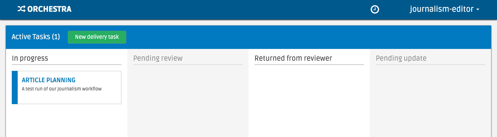
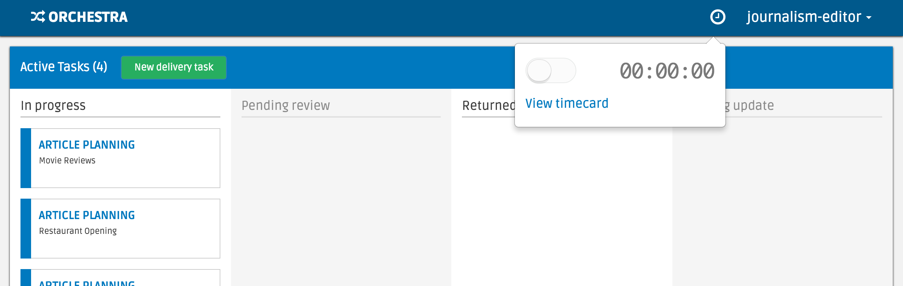

###################
Feature Walkthrough
###################

Below, we'll walk through the various features in Orchestra.

**********************
Google Drive Utilities
**********************
Coming soon...

*************
Time Tracking
*************

Workers can track time spent on a task using the timer/timecard feature. We
provide both a timer widget that workers can turn on to track time, and a
timecard page where workers can update and manually create time entries.

Timer
===========

The navigation bar in the task dashboard and task pages has a timer icon.

When clicked on, a dropdown appears that allows the worker to toggle a timer
to track their work time.

The worker can optionally add a description and specify the task they are
working on.

When the timer is stopped, a time entry is automatically created for the
amount of time tracked. A worker can go to the timecard page to edit and
manually add time entries.

Timecard
===========

The timecard page contains a list of time entries for the past week, grouped
by date.

.. image:: ../static/img/time_tracking/timecard.png

Data Models
===========

TimeEntry
Timer
