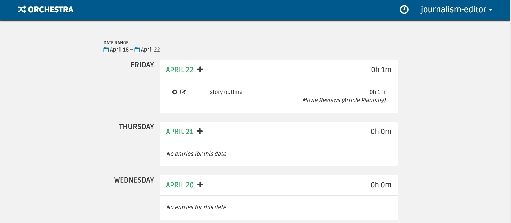

###################
Feature Walkthrough
###################

Below, we'll walk through the various features in Orchestra.

*************
Time Tracking
*************

Workers can track time spent on a task using the timer/timecard feature. We
provide both a timer widget that workers can turn on to track time, and a
timecard page where workers can update and manually create time entries.

Timer
=====

The navigation bar in the task dashboard and task pages has a timer icon.

.. image:: ../static/img/time_tracking/timer_icon.png

If you click on the timer icon, a dropdown appears that allows the worker
to toggle a timer to track their work time.

After the timer is started, the worker can add a description and specify
the task they are working on. If the timer is started in a task interface,
the task field is pre-populated.

When the timer is stopped, a time entry is automatically created for the
amount of time worked. A worker can go to the timecard page to edit and
manually add time entries.

Timecard
========

The timecard page by default shows a list of time entries for the current
work week, starting on Monday, grouped by date. You can use the date range
pickers at the top to change the entries shown.

The time to the right of the date shows the total time worked that day.

A time entry can be manually added (versus automatically added by stopping the
timer) by clicking the plus icon next to each date.

Each time entry can be edited by clicking the pencil icon, or deleted by
clicking the x icon.

If a time entry is missing a description or a task, the missing fields are
highlighted and the total hours for the day is hidden.

.. image:: ../static/img/time_tracking/timecard_entry_invalid.png

Quirks
======

- Time entries automatically created when the timer is stopped have the date
  set to the current UTC timestamp date. This means that the date might be
  different than the date in the worker's time zone. In general, handling time
  entries across multiple time zones is difficult, and we are still working on
  a better user experience.
- Time entries automatically created when the timer is stopped have the work
  time set to the hours:minutes:seconds displayed in the timer. However, the
  timecard page only shows hours:minutes for time entries for readability.
  Time entries are rounded up to the minute, and the sum for the day reflects
  the sum of the *rounded* times, **not** the rounding of the sum of unrounded
  times.
